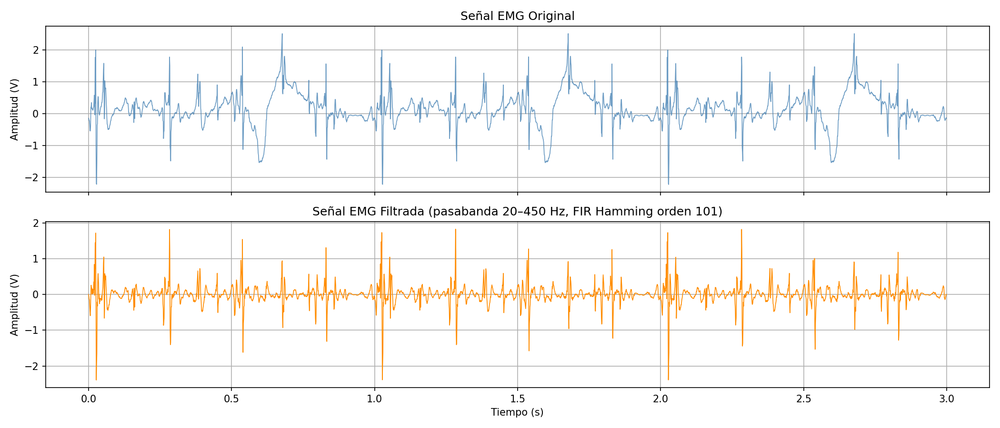
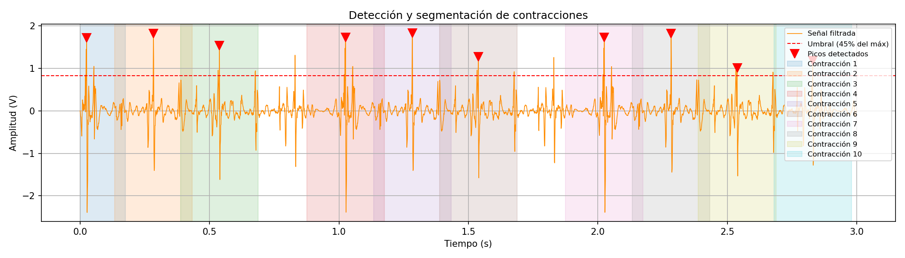

# LABORATORIO-4-FATIGA

Este laboratorio consiste en capturar y analizar señales de los músculos (EMG) para observar cómo cambian sus propiedades de tiempo y frecuencia mientras se realiza un ejercicio específico.
## Objetivo General: 
Identificar cambios en las características espectrales de una
señal electromiográfica (EMG) cuando se alcanza la fatiga muscular.
## Objetivos Específicos:
1. Aplicar el filtrado de señales continuas para el procesamiento una señal
electromiográfica (EMG).

2. Detectar la aparición de fatiga muscular mediante el análisis espectral de
contracciones musculares individuales.

4. Comparar el comportamiento de una señal emulada y una señal real en
términos de frecuencia media y mediana.

5. Emplear herramientas computacionales para el procesamiento,
segmentación y análisis de señales biomédicas. 


## PARTE A 
### ALGORITMO 

### CODIGO 
Para comenzar el análisis, se definieron los parámetros principales que se utilizarán a lo largo del código.
```
Fs           = 1000       
F_bajo       = 20         
F_alto       = 450        
ordenf = 101        
factorumbral = 0.45      
Distanciapicos = 200     
Ventana  = 150
```
Fs = 1000 corresponde a la frecuencia de muestreo con la que se capturó la señal, es decir, se tomaron 1000 muestras por segundo. 
F_bajo = 20 y F_alto = 450 son las frecuencias de corte del filtro pasabanda,que se encargan de delimitar  el rango de frecuencias en una señal EMG.
ordenf = 101 define la selectividad  del filtro, este valor debe ser impar en filtros FIR. 
factorumbral = 0.45 representa que solo se considerarán como contracciones los picos que superen el 45% del valor maximo positivo de la señal. 
Distanciapicos = 200 establece que entre dos picos detectados debe haber al menos 200 muestras de separación para evita detectar dos veces el mismo evento. 
Finalmente, Ventana = 150 determina cuántas muestras se extraen antes y después de cada pico para conformar el segmento de cada contracción.

Posterior a la definición de los parámetros, se cargo el archivo de la señal capturada en el laboratorio
```
datos = np.loadtxt(Archivo, comments='#', encoding='latin-1')
tiempo = datos[:, 0]
senal  = datos[:, 1]

```
En el archivo de la señal se tienen 2 columnas: 
la primera corresponde al tiempo en segundos y la segunda a la amplitud de la señal en voltios. Ademas se agrego encoding='latin-1' debido a que el nombre del archivo contiene la letra  ñ ('captura_señal_fs1000_duracion3.txt´)


Posterior a la carga de la señal, se opto por aplicar unu filtro FIR Hamming debido a que este tipo de filtro es ampliamente utilizado en el procesamiento de señales biomédicas debido a su buen compromiso entre selectividad y atenuación en la banda de rechazo.

Adicional a esto  normalizaron las frecuencias de corte con respecto a la frecuencia de Nyquist,  lo que equivale a la mitad de la frecuencia de muestreo
```
frecuencias_norm = [F_bajo / (Fs / 2), F_alto / (Fs / 2)]
coef_b = firwin(ordenf, frecuencias_norm, pass_zero=False, window='hamming')
```
firwin es la función que permite  calcular los coeficientes del filtro FIR. Al pasarle dos frecuencias de corte y el parámetro pass_zero=False, se le indica que debe dejar pasar las frecuencias entre F_bajo y F_alto, es decir, entre 20 y 450 Hz, evitando el paso de  todas las frecuencias que se encuentren  fuera  de ese rango. La ventana hamming se encarga de suavizar los coeficientes para reducir las oscilaciones no deseadas en la respuesta en frecuencia del filtro.

Posterior a esto se aplico el filtro a la señal obtenida
```
senal_filtrada = filtfilt(coef_b, [1.0], senal)

```
Se  utilizó filtfilt en lugar de lfilter ya que se debe  aplicar el filtro dos veces, una hacia adelante y otra hacia atrás, lo que permite  garantizar que la señal filtrada no se desfase.

Posterior al filtrado, , se graficaron la señal original y la señal filtrada para comparar los resultados obtenidos
```
fig, axs = plt.subplots(2, 1, figsize=(14, 6), sharex=True)

axs[0].plot(tiempo, senal, color='steelblue', alpha=0.8, linewidth=0.8)
axs[0].set_title('Señal EMG Original')
axs[0].set_ylabel('Amplitud (V)')
axs[0].grid(True)

axs[1].plot(tiempo, senal_filtrada, color='darkorange', linewidth=0.8)
axs[1].set_title(f'Señal EMG Filtrada (pasabanda {F_bajo}–{F_alto} Hz, FIR Hamming orden {ordenf})')
axs[1].set_ylabel('Amplitud (V)')
axs[1].set_xlabel('Tiempo (s)')
axs[1].grid(True)

plt.tight_layout()
plt.savefig('1_senal_original_vs_filtrada.png', dpi=150)
plt.show()
```
Al comparar   las gráficas obtenidas, el filtro eliminó correctamente las  bajas frecuencia, y las  altas frecuencias, conservando únicamente la actividad muscular de interés.


Para la identificacion de cada contración ocurrida durante la señal, se opto por detectar los picos presentes en esta en la parte positiva de la señal filtrada
```
senal_positiva = senal_filtrada.copy()
senal_positiva[senal_positiva < 0] = 0

umbral = factorumbral * np.max(senal_positiva)

picos, propiedades = find_peaks(senal_positiva, height=umbral, distance=Distanciapicos)
```
Al usar la señal filtrada ee pusieron todos los valores negativos en cero para obtener únicamente los picos positivos, posterior a esto  se calculó el umbral multiplicando el valor máximo positivo de la señal por "factorumbral = 0.45" para lograr una  detección correcta  de las contracciones presentes en la señal

Finalmente, el comando find_peaks se encarga de buscar todos los picos que cumplan dos condiciones:
1. Que superen el umbral calculado
2. Que estén separados entre sí por al menos Distanciapicos = 200 muestras (equivalente a 0.2 segundos)
   ```
print(f"Contracciones detectadas: {len(picos)}")
print(f"Posiciones (muestras): {picos}")
print(f"Tiempos (s): {tiempo[picos].round(3)}")
   ```

 ```


## PARTE B 
En la parte B se realizará el procesamiento y análisis de una señal electromiográfica (EMG) adquirida por medio del BITalino y sus respectivos electrodos con el objetivo de
evaluar el comportamiento espectral asociado a la fatiga muscular. Para ello, la señal será preprocesada mediante la eliminación del componente DC y la aplicación de un
filtro pasa banda entre 20 y 450 Hz. Posteriormente, se dividirá en ventanas consecutivas de igual duración, a las cuales se les aplicará la Transformada Rápida de Fourier 
(FFT), considerando únicamente la parte positiva del espectro. La representación de los resultados se realizará en escala semilogarítmica en el eje de frecuencia.
Finalmente, se calcularán la frecuencia media y la frecuencia mediana para cada ventana, con el fin de analizar la evolución de estas magnitudes a lo largo del tiempo.<br>

### ALGORITMO 


### CODIGO 

```
import numpy as np
import matplotlib.pyplot as plt
from scipy.signal import butter, filtfilt
file = r"C:\Users\aleja\Downloads\alejaemg_2026-04-10_14-46-10.txt"
data = []
with open(file, 'r') as f:
    for line in f:
        if not line.startswith('#'):
            values = line.strip().split('\t')
            if len(values) > 5:
                data.append(float(values[5]))  # columna A1
data = np.array(data)
fs = 1000  # Hz
```
Este código carga una señal desde un archivo de texto para poder analizarla después.
Primero, importa las librerías necesarias y abre el archivo, leyendo línea por línea. Extrae los datos de la columna A1, 
que es la señal de interés. Luego, guarda esos valores en un arreglo de NumPy para facilitar su manejo. Finalmente, define
la frecuencia de muestreo en 1000 Hz, que es importante para el análisis de la señal.<br>

```
fs = 1000
low = 20
high = 450
order = 4
b, a = butter(order, [low/(fs/2), high/(fs/2)], btype='band')

def filtro_manual(x, b, a):
    y = np.zeros(len(x))    
    for n in range(len(x)):
        for k in range(len(b)):
            if n-k >= 0:
                y[n] += b[k] * x[n-k]
        for k in range(1, len(a)):
            if n-k >= 0:
                y[n] -= a[k] * y[n-k]
        y[n] = y[n] / a[0]
    return y
x_filt = filtro_manual(x, b, a)     
```
Este fragmento implementa el filtrado de la señal de forma manual. Primero, 
se definen los parámetros del filtro pasa banda (frecuencias de corte, frecuencia de muestreo y orden)
y se obtienen sus coeficientes con butter. Luego, en lugar de usar una función automática, 
se crea una función que aplica el filtro mediante la ecuación en diferencias, calculando cada muestra
de salida a partir de valores actuales y pasados de la entrada y de la salida. Finalmente, esta función 
se usa para obtener la señal filtrada.<br>
<br>


```
plt.figure()
plt.plot(x_filt)
plt.title("Señal EMG Filtrada")
plt.xlabel("Muestras")
plt.ylabel("Amplitud")
plt.grid()
plt.show()

```
Este fragmento se encarga de visualizar la señal filtrada. Primero, crea una nueva figura y luego grafica la 
señal x_filt en función de las muestras. Después, se añaden un título y etiquetas a los ejes para facilitar la 
interpretación de la gráfica, y se activa una cuadrícula para mejorar la lectura.Finalmente, se muestra la gráfica,
permitiendo observar el comportamiento de la señal EMG después del filtrado.<br>

```
num_windows = 6 
N = len(x_filt)
L = N // num_windows
f_mean = []
f_med = []

```
Este fragmento prepara el análisis de la señal por segmentos. Primero, se define el número de ventanas
en las que se va a dividir la señal (6). Luego, se calcula la longitud total de la señal filtrada 
y el tamaño de cada ventana, dividiendo el total entre el número de segmentos. Finalmente,
se crean dos listas vacías donde se almacenarán posteriormente la frecuencia media y la 
frecuencia mediana calculadas en cada ventana.<br>
```
for i in range(num_windows):
    seg = x_filt[i*L:(i+1)*L]

    Nseg = len(seg)
    Y = np.fft.fft(seg)
    P = np.abs(Y)**2

    # SOLO PARTE POSITIVA
    f = np.fft.fftfreq(Nseg, d=1/fs)
    mask = f >= 0

    f = f[mask]
    P = P[mask]
```
realizamos el análisis en frecuencia de cada segmento de la señal. Primero, recorriendo
cada una de las ventanas definidas y extrayendo el segmento correspondiente de la señal filtrada. 
Luego, calcula la Transformada Rápida de Fourier (FFT) de ese segmento para obtener su contenido en
frecuencia, y a partir de esto obtiene la potencia del espectro. Después, genera el vector de frecuencias 
asociado y se queda únicamente con la parte positiva del espectro.<br>

```
 plt.figure()
    plt.semilogx(f, P)
    plt.title(f"Espectro ventana {i+1}")
    plt.xlabel("Frecuencia (Hz) - escala log")
    plt.ylabel("Potencia")
    plt.grid()
    plt.show()
```
Este fragmento se encarga de graficar el espectro de potencia de cada ventana de la señal.
Primero, crea una nueva figura y luego utiliza una gráfica semilogarítmica en el eje de la frecuencia
para visualizar mejor el comportamiento del espectro en diferentes rangos. Después, agrega un título
que identifica la ventana analizada, junto con las etiquetas de los ejes y una cuadrícula para facilitar 
la interpretación. Finalmente, muestra la gráfica para observar cómo se distribuye la potencia en función de la frecuencia en cada segmento.<br>
```
    f_mean_i = np.sum(f * P) / np.sum(P)
    f_mean.append(f_mean_i)

    cumsumP = np.cumsum(P)
    idx = np.where(cumsumP >= cumsumP[-1]/2)[0][0]
    f_med_i = f[idx]
    f_med.append(f_med_i)

f_mean = np.array(f_mean)
f_med = np.array(f_med)

print("Frecuencia media:", f_mean)
print("Frecuencia mediana:", f_med)
```
Este fragmento calcula características importantes del espectro en cada ventana de la señal. Primero, 
obtiene la frecuencia media como un promedio ponderado usando la potencia, lo que indica en qué rango de frecuencias
se concentra la energía. Luego, calcula la frecuencia mediana, que corresponde al punto donde se acumula el 50% de la potencia
total del espectro.<br> 
Ambos valores se almacenan en listas para cada segmento. Al final, estas listas se convierten en arreglos de NumPy 
y se imprimen, mostrando cómo varían estas frecuencias a lo largo de la señal.<br>

```
plt.figure()
plt.plot(f_mean, '-o', label='Frecuencia media')
plt.plot(f_med, '-x', label='Frecuencia mediana')
plt.title("Evolución de la fatiga muscular")
plt.xlabel("Ventanas / Contracciones")
plt.ylabel("Frecuencia (Hz)")
plt.legend()
plt.grid()
plt.show()
```
Este fragmento grafica la evolución de la fatiga muscular a lo largo del tiempo. Para ello, 
muestra cómo cambian la frecuencia media y la frecuencia mediana en cada ventana de la señal, 
utilizando marcadores distintos para diferenciarlas. Además, se añaden título, etiquetas en los ejes,
leyenda y cuadrícula para facilitar la interpretación.<br>
Esta gráfica permite observar posibles disminuciones en la frecuencia, que suelen estar asociadas a la aparición de fatiga muscular.<br>
### GRAFICAS

<br>
La gráfica muestra la señal EMG ya filtrada en el tiempo. Se puede observar que al inicio la amplitud es bastante alta y con muchas variaciones, lo que indica una mayor actividad muscular. A medida que avanzan las muestras, la señal va disminuyendo su amplitud y se vuelve más “suave”, lo que puede relacionarse con fatiga muscular, ya que el músculo pierde fuerza y la activación disminuye. También se ven algunos picos aislados, que pueden corresponder a contracciones más fuertes en ciertos momentos. En general, la señal está bien centrada y sin ruido evidente, lo que confirma que el filtrado fue adecuado.<br>

<br>
En este espectro de la ventana 1 se observa cómo está distribuida la energía de la señal en frecuencia. La mayor parte de la potencia se concentra aproximadamente entre 50 y 150 Hz, con un pico marcado cerca de los 100 Hz, lo cual es típico en señales EMG. Esto indica que en esta primera parte hay una alta actividad muscular con predominio de frecuencias medias. Fuera de ese rango, la potencia es mucho menor, lo que muestra que el filtrado funcionó bien al eliminar componentes no relevantes.<br>

<br>
En este espectro de la ventana 2 se observa un comportamiento muy similar al de la ventana 1, donde la mayor parte de la potencia sigue concentrada entre aproximadamente 50 y 150 Hz. Sin embargo, se notan picos un poco más altos y definidos, lo que puede indicar una contracción muscular más fuerte o más estable en este segmento. El hecho de que la energía siga en ese rango confirma que la señal mantiene características típicas de EMG y que el filtrado continúa siendo adecuado.

<br>
En el espectro de la ventana 3 se observa que la mayor parte de la potencia sigue concentrada entre 50 y 150 Hz, pero en este caso los picos son más altos, lo que indica una mayor energía en la señal en este segmento. Esto puede relacionarse con una contracción muscular más intensa o un mayor esfuerzo en ese intervalo. En general, se nota un aumento en la magnitud del espectro en comparación con las ventanas anteriores.<br>

<br>
En el espectro de la ventana 4 se observa que la mayor parte de la potencia de la señal se concentra en el rango aproximado de 60 a 140 Hz, lo cual es característico de señales EMG con predominio de frecuencias medias. Se destaca un pico muy pronunciado alrededor de los 100 Hz, indicando una componente dominante y una mayor actividad muscular en este segmento. Además, aparecen otros picos de menor magnitud dentro del mismo rango, lo que sugiere variaciones en la activación. Por fuera de estas frecuencias, la potencia disminuye considerablemente, evidenciando que el contenido relevante de la señal está bien concentrado.<br>

<br>
En el espectro de la ventana 5 se observa que la energía de la señal se concentra principalmente entre aproximadamente 60 y 150 Hz, manteniendo el comportamiento típico de una señal EMG en frecuencias medias. Se destaca un pico dominante cercano a los 100 Hz, aunque con menor intensidad que en la ventana anterior, lo que sugiere una ligera variación en la actividad muscular. También se evidencian varios picos secundarios dentro del mismo rango, indicando variabilidad en la señal. Fuera de este intervalo, la potencia es considerablemente menor, lo que confirma que la información relevante está bien localizada en ese rango de frecuencias.<br>

<br>
En el espectro de la ventana 6 se observa que la mayor parte de la potencia se concentra entre aproximadamente 60 y 140 Hz, lo que sigue siendo característico de una señal EMG con predominio en frecuencias medias. Se destaca un pico muy pronunciado alrededor de los 100 Hz, incluso más alto que en la ventana anterior, lo que indica un aumento en la actividad muscular en este segmento. Además, se presentan varios picos secundarios dentro del mismo rango, reflejando variabilidad en la señal. Fuera de este intervalo, la potencia es baja, evidenciando que el contenido relevante de la señal está bien concentrado en ese rango de frecuencias.<br>

| VENTANA | F MEDIA | F MEDIANA|ANALISIS |
|---------|---------|----------|-----------|
| 1 |95.97655657 | 86.85015291 |Se observa una frecuencia media y mediana relativamente altas,lo que indica buena actividad muscular y poca fatiga al inicio.|
| 2 |95.2666646  | 83.66972477 |Hay una leve disminución en la frecuencia mediana, lo que puede empezar a mostrar un pequeño cambio en la respuesta muscular.|
| 3 |96.32907568 | 84.15902141 |La frecuencia media aumenta un poco, lo que sugiere que aún hay buena activación muscular en este punto.|
| 4 |96.70913381 | 82.32415902 |Se mantiene la frecuencia media alta, pero la mediana baja ligeramente, lo que podría indicar el inicio de fatiga.|
| 5 |95.80389132 | 80.97859327 |Ambas frecuencias disminuyen más, mostrando una tendencia más clara hacia fatiga muscular.|
| 6 |92.85376582 | 80.24464832 |Se observa la menor frecuencia media y mediana, lo que indica mayor fatiga y reducción en la actividad muscular.|

<br>
En la gráfica de evolución de la fatiga muscular se observa que la frecuencia mediana presenta una tendencia descendente a medida que avanzan las ventanas, pasando de valores cercanos a 87 Hz hasta aproximadamente 80 Hz, lo cual es un indicador típico de fatiga muscular. Por otro lado, la frecuencia media se mantiene relativamente estable alrededor de los 95–97 Hz durante las primeras ventanas, pero muestra una ligera disminución hacia el final. Este comportamiento sugiere que, aunque la actividad global se mantiene, hay un desplazamiento del contenido espectral hacia frecuencias más bajas, confirmando la aparición progresiva de fatiga en el músculo analizado.<br>

 ## PARTE C
